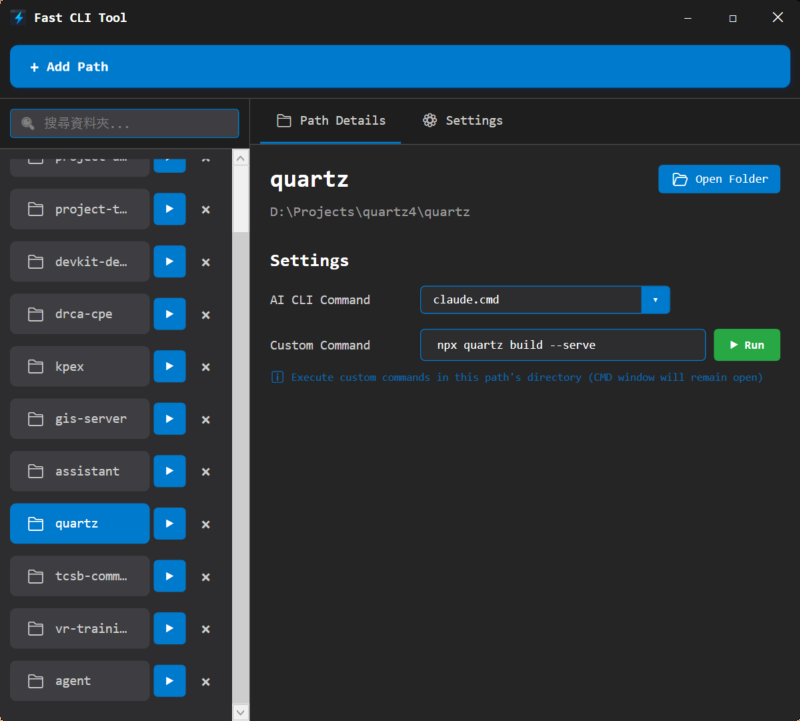

# Fast CLI Tool

一款 Windows 桌面工具，用於快速在專案目錄中啟動 AI CLI 工具（如 Claude Code）。



## 功能

- **路徑管理** — 新增、移除專案資料夾
- **快速啟動** — 在指定路徑下直接開啟 AI CLI 工具（如 `claude.cmd`）
- **自訂指令** — 每個專案可設定多組自訂命令（透過 `cmd.exe` 執行）
- **搜尋過濾** — 即時依資料夾名稱篩選
- **設定** — 可調整預設的 CLI 命令
- **自動儲存** — 所有變更自動持久化

## 技術棧

- .NET 9.0 / WPF
- MVVM 架構
- 深色主題（VS Code 風格）

## 建置

需要 [.NET 9.0 SDK](https://dotnet.microsoft.com/download/dotnet/9.0)。

```bash
# 開發建置
dotnet build

# 發佈為單一執行檔（自包含）
dotnet publish -c Release -r win-x64 --self-contained -p:PublishSingleFile=true -p:IncludeNativeLibrariesForSelfExtract=true -o bin/publish-single
```

## 授權

[MIT](LICENSE)
